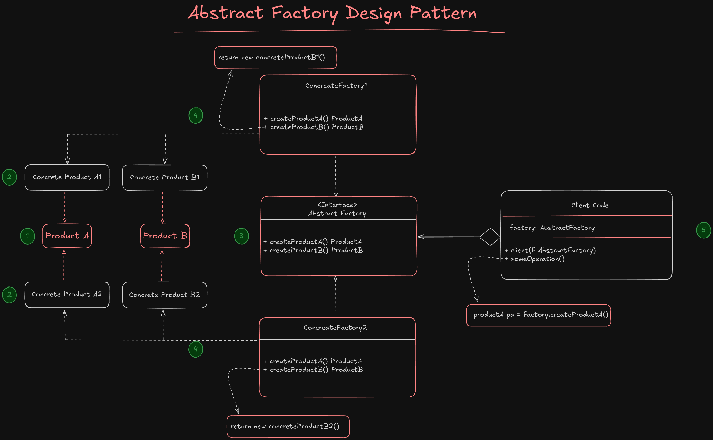
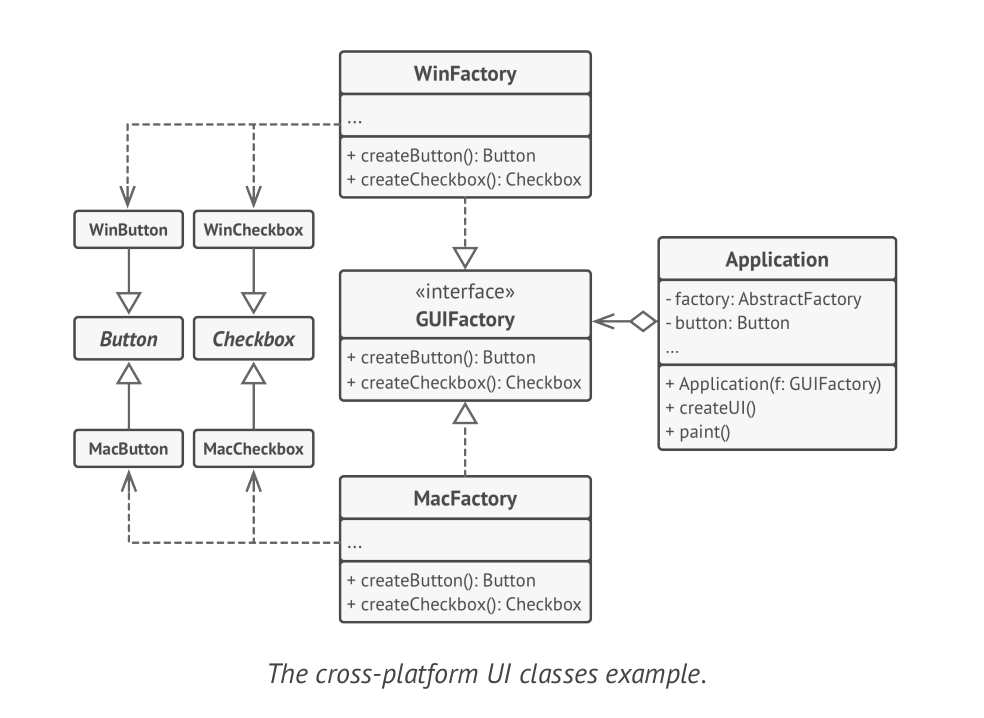

# Abstract Factory

**Abstract Factory** is a creational design pattern that let you produce families of related objects without specifying their concrete classes.

When you have some products, that they has some shared categories, you can use abstract factory for grouping common products, to be used in client code. But What I really mean by that?

Imagine that you have 3 type of products: (Chair, Sofa, CoffeeTable), and all this products are available in 3 different categories: (Modern, classic, wooden). Now, For creating a client code that work without coupling to the type of product or even its category, you can define **abstract factory** design pattern.

1. For creating abstract factory, you first have to define an interface for each type of products
2. Then, you have to create your products and implement it's interface for each category of every product. After this you'll have 9 different product based on our example, 3 category for each 3 product.
3. Next, you have to define an interface for your factory class, and define an abstract methods for creating each product. The factory method that will be create product, must return an object that must **implement product interface**.
4. After that, you have to define your factory classes, for return products based on categories. For our example you'll define 3 different factory classes that return products that has one category. For example `createModernProductFactory`, `createClassicProductFactory` and `createWoodenProductFactory`.
5. Finally, you will use your factory class based on an environment variable or user needs.

## Structure



1. **Abstract products** will define an interface of methods for a set of distinct but related products which make up a product family.
2. **Concrete products** are various implementation of abstract products, grouped by variants. Each abstract product (Chair, Sofa, CoffeeTable) should be implemented in all given variants (Modern, Classic, Wooden).
3. The **Abstract Factory** interface should create some factory methods that each of them return a special product interface.
4. **Concrete Factories** should implement creation method of abstract factory. Each concrete factory correspond to a special variant of products and creates only those product variant.

> [!IMPORTANT]
> Each **concrete factory** should return product that implement it's **product interface**. By following this rule, the **Client** will not get coupled to the variant of product, and just threat a product with its defined inteface. 
> The client will work with any concrete factory/product variant as long as they implement their abstract interfaces.

### Example

Below, there is an example of implementing abstract method in some real world application:



### Applicability

**Use the Abstract factory method when your code needs to deal with various families of related products. But you don't want to depend it to the different concrete classes of those products. They might be unknown beforehand or you simply want to allow for future extensibility.**

> [!NOTE]
> In a well-designed program, every class is responsible only for one thing, so when a class deals with multiple product types, it may be worth extracting its factory methods into a standalone factory class or a full-blown abstract factory implementation.

### How to implement this pattern?

1. Create a map of **distinct product types** versus variants of these products.
2. Declare abstract product interfaces for each type of product. Then make all concrete classes implement this interface.
3. Declare the **abstract factory** interface with a set of creation methods for all abstract products.
4. Implement a set of concrete factory classes, one for each product variant.
5. Create factory initialization code somewhere in application. It should instantiate one of the concrete factory classes. Pass this factory object to all refrences to constructing products.
6. Scan through application and find all relevant to constructing products, replace them by using the factory object.

> [!NOTE]
> All the products that are creating in a concrete factory, are compatible with eachother, and can work together. But products with different variants are not compatible with each other and can't work together.


#### Pros and cons

1. You can sure that products that you're getting from a factory object are compatible with eachother.
2. You avoid tight coupling between client code and concrete products.
3. *Single responsibility principle*: You can extract the product creation code into one place
4. *Open/Closed Principle*: You can add new variant for products without breaking existing code.
5. The code may become complicated that it should be, since a lot of concrete classes with their interfaces are added to the code

##### Abstract Factory vs Factory Method
database system
| **Feature** | **Abstract Factory** | **Factory Method** |
| --- | --- | --- |
| **Purpose** | Creating **families** of related object | Create **one type** of object |
| **Structure** | Contains multiple factory methods | Contains a single factory method |
| **Product Variety** | Produces multiple related products | Focus on creating a single product |
| **Use Cases complexity** | More complex, involves object families | Simpler, single object creation |
| **Example** | GUI toolkit for multiple OS (Mac, Windows, Linux) | Logger factory (FileLogger, DBLogger) |

> [!NOTE]
> As an example, imagine that you want to have a db for your application that you can have **CRUD** operations on db. First you define the interface and then use the **Factory Method** design pattern for your project. Why? Because you only have a single type of product that may be changes in future. But imagine that you want to have 2 database at a time in your application, that you want to have some database for storing logs. In this case, you add a new interface for your logger database, and then use **abstract factory** pattern for decouple your client code from database types, and provide **Open/Close** principle into your application.

#### Real world example and use cases

- **GUI library**: Create UI elements (Button, TextBox) for multiple platforms (Windows, Mac, Linux)
- **Database drivers:** Generate DB connections, queries, and result readers for different databases
- **Theme engines**: Create related components (text color, button style, icons) based on theme
- **Game development**: Create families of enemy types depending on the game level or biome
- **Notification System**: Create related message sender objects (EmailSender, SMSSender) depending on the communication channel

```go
package main

import "fmt"

// -------- Abstract Products --------
type Button interface {
 Render()
}

type TextBox interface {
 Display()
}

// -------- Concrete Products --------
type WinButton struct{}
func (w *WinButton) Render() {
 fmt.Println("Rendering Windows Button")
}

type MacButton struct{}
func (m *MacButton) Render() {
 fmt.Println("Rendering Mac Button")
}

type WinTextBox struct{}
func (w *WinTextBox) Display() {
 fmt.Println("Displaying Windows TextBox")
}

type MacTextBox struct{}
func (m *MacTextBox) Display() {
 fmt.Println("Displaying Mac TextBox")
}

// -------- Abstract Factory --------
type GUIFactory interface {
 CreateButton() Button
 CreateTextBox() TextBox
}

// -------- Concrete Factories --------
type WinFactory struct{}
func (wf *WinFactory) CreateButton() Button {
 return &WinButton{}
}
func (wf *WinFactory) CreateTextBox() TextBox {
 return &WinTextBox{}
}

type MacFactory struct{}
func (mf *MacFactory) CreateButton() Button {
 return &MacButton{}
}
func (mf *MacFactory) CreateTextBox() TextBox {
 return &MacTextBox{}
}

// -------- Client Code --------
type Application struct {
 button Button
 textBox TextBox
}

func NewApplication(factory GUIFactory) *Application {
 return &Application{
  button: factory.CreateButton(),
  textBox: factory.CreateTextBox(),
 }
}

func (app *Application) RenderUI() {
 app.button.Render()
 app.textBox.Display()
}

// -------- Main --------
func main() {
 var factory GUIFactory

 os := "mac" // change this to "win" to see other result

 if os == "win" {
  factory = &WinFactory{}
 } else {
  factory = &MacFactory{}
 }

 app := NewApplication(factory)
 app.RenderUI()
}
```