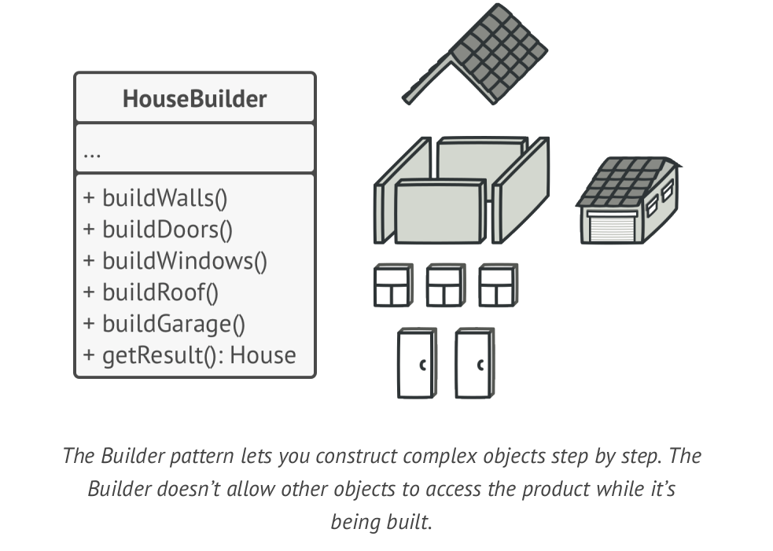
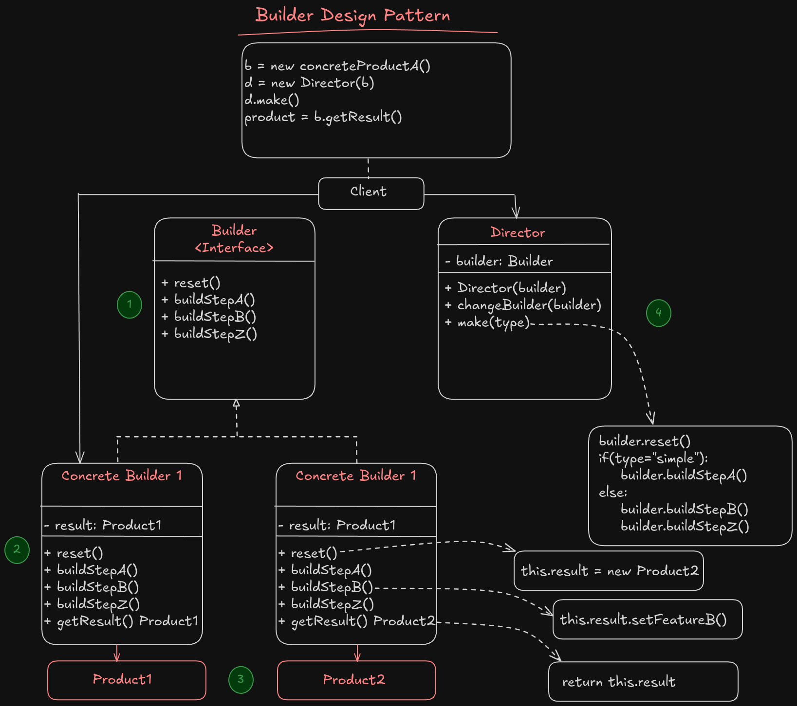

# Builder

**Builder** is a creational design pattern that lets you construct complex objects step by step. The pattern allows you to produce different types and representations of an object using the same construction code.

## Key Concepts

- Separate the **construction** of an object from its **representation**
- Useful when **creation** process involves multiple steps, or when an object has many optional fields or features.
- Avoid **constructor pollution** with too many parameters.

Imagine that we want to have a constructor for creating a **House** object. We can Have multiple type of houses, (House with garden, House with pool, House with garage). If we want to handle all these features in a constructor class, it could be so comlicated or ugly.

For example one approach is to define the constructor method with many different parameters: `constructor(pool: bool, garden: bool, yard: bool, garage: bool, window: int, door: string, ....)`. Then for calling the constructor, we must send many different parameters, that would not be necessary at all. *For example 90% of todays houses has no swimming pool*, so we must add a `false` for the pool parameter each time.

Another approach is to create different subclasses for each type of house. Using this approach will lead us with many subclasses from `House` at the end. Imagine that for 2 exact house, that one of them has pool rather than the other one, we must define 2 classes. 

The **Builder** pattern suggests that your extract the construction of the object from the class and move it to a separate object called **builder**.

For example, to simply define a builder for constructing house we could have a builder class like this:



The pattern will separate each object construction into a set of steps (`buildWall`, `buildDoor`, etc).
For creating an object, you have to execute a series of these steps on a builder object, and the important part is that **you don't need to call all these steps**! You call only those steps that are necessary for producing a particular configuration of an object.

### Director

You can create a *Director* class which will handle some basic operations by using builder for us. Generally you can extract a set of method calls to the builder class into a seperated class named **director**.
The director class defines the order in which to execute the building steps, while the builder class provides the implementation for those steps.

> [!NOTE]
> Having a **Director** class is not necessary, but it's recommended in order to facing with direct concrete product classes `(Builders)` in the client code.
> It also improve usability, which you can reuse this director class in many other places.
> The director class also hide the construction process from the client code, the client just have to initialize builder, work with director to create the product then fetch the created product from builder. As easy as possible

### Structure



1. **The Builder interface** declares product construction steps that are common to all types of builders.
2. **Concrete builders** provide different implementation of builder interface to build different products. **Also the concrete builders may introduce products that has different interfaces**
3. **Products** are resulting objects. Products constructed by different builders don't have to belong to the same interface.
4. **The Director class** defines steps to call constructor class for hide details of product constructions from client code.
5. **Client code** must associate one builder with director class for object constructions. You can have a method for a director to chage the builder class while it's in production stage, to create another type of product without downtime.

> [!IMPORTANT]
> We cannot use director class to fetch the constructed product, because it will coupled to the product type. By removing coupling between the director object construction, we can use different builders in director class.
> But,for fetching constructed product we can make a `getResult() Product` method in each concrete products that will return the created product to our client code. This way, we remove coupling and improve the performance of the code.
> Usually, after returning the end result to the client, a builder instance is expected to be ready to start producing another product. That's why it's a usual practice to call the reset method at the end of the `getProduct` method body. However, this behavior isn't **mandatory**, and you can make your builder wait for an explicit reset call from the client code before disposing of the previous result.

> Unlike other creational patterns, builder lets you construct unrelated products that don't follow a common interface.

### Applicability

- Use the builder pattern to get rid of **telescopic constructor**:

The telescopic constructor is a concept when your construction method has many optional parameters and you're forced to give them all in calling construction method. However the builder patter allows you to create what ever you want. It's simply like cooking. You can add salt, paper, sause and everything you like and remove those you're not fine with.

- Use the builder pattern when you want to your code be able to create different representations of some product (wooden house or stone house as an example).

The Builder pattern can be applied when construction of various representations of the product involves similar steps that differ only in the details.

- Use the builder patter for construct composite trees or complex objects.

The builder pattern lets you build the final object step by step. You could defer the execution of some steps without breaking the final product. You can call even recursively which comes in handy when you need to build an object tree.

### Implementation

1. Make sure that you've clearly defined the common interface for construction of different objects, otherwise you cannot implement the pattern
2. Declare this steps in the base builder class interface
3. Create a concrete builders for each type of product representations and implement the base builder interface for them. Don't forget to implement a method for fetching the final product as well
4. Think about creating a director class. It may encapsulate various ways for constructing a product using a same builder object
5. The client code should both define the **builder** and the **director** objects.  Before construction starts, the client must pass a builder object to the directort, to define which builder is used for creating object.
For passing the builder there is 2 different approach:
5. 1. The client pass the builder to the director, and director save it as a parameter in a private field for using in the direcor class
5. 2. The client pass the builder to the director construction method, by having this approach you can use construction methods with different builders more easily.
6. The construction result may return directly from the director if all products follow a same interface, otherwise, we have to use builders to fetch the constructed products.

#### Pros

- You can construct objects step by step, defer constructions step or run them recursively
- You can use the same construction code when building various representations of products
- **Single Responsibility Principle** You can Isolate complex constructions from the business logic.

#### Cons

- The overal complexity of the code increases beacause new classes have to added

#### Examples

- `strings.Builder` in Go (not a design pattern, but a literal builder).

- SQL query builders.

```go
query := NewQueryBuilder().
    Select("name", "age").
    From("users").
    Where("age > ?", 18).
    OrderBy("created_at DESC").
    Limit(10).
    Build()
```

- HTTP request builders (http.NewRequest in Go, or RequestBuilder pattern).

```go
req := NewRequestBuilder().
    Method("POST").
    URL("https://api.example.com").
    Header("Authorization", "Bearer token").
    JSONBody(map[string]string{"name": "amir"}).
    Build()

```

- UI builders for forms, widgets, etc.

```go
form := NewFormBuilder().
    AddTextInput("Name").
    AddCheckbox("Subscribe").
    AddDropdown("Gender", []string{"Male", "Female"}).
    Build()
```

- Logger

```go
logger := NewLoggerBuilder().
    SetLevel("debug").
    EnableFileOutput("app.log").
    EnableColor().
    WithTimestampFormat(time.RFC822).
    Build()
```

- Json object creator

```java
JsonObjectBuilder b = Json.createObjectBuilder().
            add( "report", Json.createObjectBuilder().
                 add( "reportId", reportId ).
                 add( "title", title ).
                 add( "subtitle", subTitle == null ? "" : subTitle ).
                 add( "created", created.toString() ).
                 add( "description", description == null ? "" : description ).
                 add( "data", report )
            );
return b.build();
```
