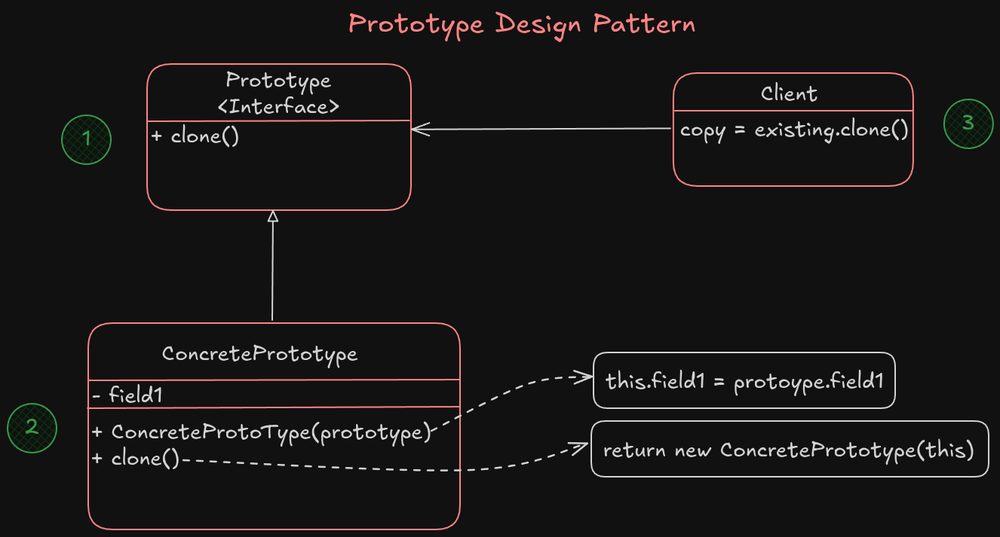
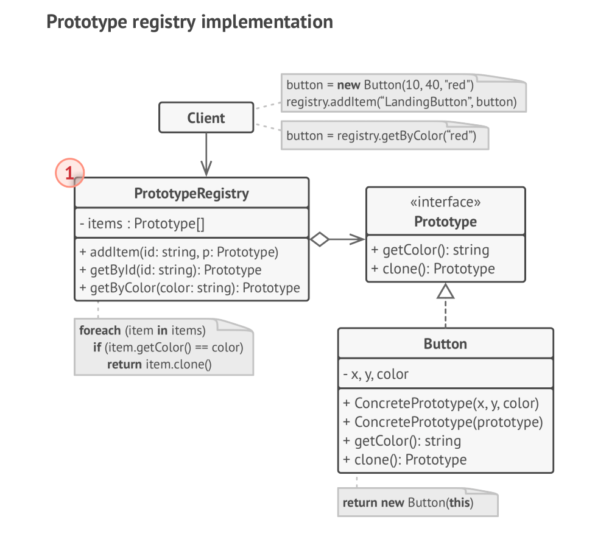

# Prototype

Prototype is a **creational** design pattern that lets you copy existing objects without making your code dependent on their classes.

Let's say that you have an object that you want to get an exact copy from it. How would you act? 

First you have to create a new object from that class, then fill the blank new object with all the fields and values are stored in your object that you want to have a copy from it.

It's nice but not all objects can be copied that way because the objects has also private fields that cannot copy that way.
Also because you have to know the object class to create a duplicate, your code become dependent to the class.

But there is a better solution:

The prototype pattern deligates the cloning process to the actual object that are being cloned. The pattern declares a common interface for all objects that support cloning. This interface lets you clone an object without copuling your code to the class of that object.
Usually such an interface contains a single `clone` method.

The implementation of `clone` method is similar in all classes. The class create a brand new object from itself and carries over all of the field values of old object into the new one, and also in most programming language you can copy private fields as well.

An object that support cloning is called *Prototype*.

Here is how it's works: You create a set of objects, configured in various ways. When you need an object like the one that you have defined before, you just clone a prototype instead of constructing a new object from scratch.

## Structure



1. The **Prototype** interface declares the cloning method, in most cases a single `clone` method.
2. The **Concrete Prototype** class implement the prototype interface.
3. A **Client** can produce a copy of any object that follows the prototype interface.

### Prototype registery

The prototype registery provides an easy way to access frequently used prototypes. It stroes a set of pre-built objects that are ready to be copied.
The simplest prototype registery is a `name -> prototype` hash map.

Below is a registery example, that is implemented in a more robust way than just a hash map:



> [!NOTE]
> The advantage of using the **Prototype** pattern is that you never will be face a partly cloned object and it will have consistency for cloning existing objects.

### Applicability

- Use the prototype pattern when your code shouldn't depend on the concrete classes of objects that you need to copy.

When your code has some objects that are following by some interfaces and you have no idea what's going on in the deeper layer, using the *Prototype* pattern is useful and sometimes necessary for cloning existing objects.

- Use the pattern when you want to reduce the number of subclasses that only differ in the way that they initialize themselves.

Sometimes wh have many subclasses that only differ in their initial configurations for initializing an object. We simply can replace this behaviour with using some pre-built prototype and keep them in a registery.

### How to implement?

1. Create a prototype interface that has `clone` method defined in it, or just add this method in the parent and all children class if there is only one class.
2. A Prototype class must define the alternative constructor that accepts an object of that class as an argument. The constructor must copy all of the field values from passed object into a newly created instance. If you're a subclass, you must call the `super` for all the private fields of a parent class to be copied as well.
3. The cloning method usally has one line that run the `new` operator with the prototypical version of the constructor. Note that every class must override the clone method to call the constructor method of its own, otherwise it could call the constructor of parent class.
4. **Optionally**, create a registery of frequently used prototypes is a centralized registery.

#### Pros

- You can clone object without coupling to the concrete classes
- You can get rid of repeated initializing code in a favor of pre-built prototypes
- You can produce complex objects more conveniently
- You get an alternative to inheritance when dealing with configuration presents for complex objects

#### Cons

- Cloning complex objects that have circular refrences might be very tricky.

#### Why and When to use prototype pattern?

1. Object creation is costly (it takes time to create an instance from scratch)
2. You want to avoid subclasses or complicated construction logic
3. You want to create independent copies of objects
4. You have a set of initialized objects and want to make new copies with slight modifications

##### Usecases

- Cloning game characters, enemies and items
- Creating UI elements with default properties
- Graphic editors, for copying existing object with it's property
- ...

### Example 

```go
package main

import "fmt"

// Prototype interface
type Cloner interface {
	Clone() Cloner
}

// Concrete type
type Config struct {
	Name   string
	Params map[string]string
}

func (c *Config) Clone() Cloner {
	// Deep copy of the map
	paramsCopy := make(map[string]string)
	for k, v := range c.Params {
		paramsCopy[k] = v
	}
	return &Config{
		Name:   c.Name,
		Params: paramsCopy,
	}
}

func main() {
	// Original object
	original := &Config{
		Name: "Production",
		Params: map[string]string{
			"DB":    "postgres",
			"Cache": "redis",
		},
	}

	// Clone it
	cloned := original.Clone().(*Config)
	cloned.Name = "Staging"
	cloned.Params["DB"] = "sqlite"

	fmt.Println("Original:", original)
	fmt.Println("Cloned:  ", cloned)
}

// Output:
// Original: &{Production map[Cache:redis DB:postgres]}
// Cloned:   &{Staging map[Cache:redis DB:sqlite]}
```

##### More examples:

- [Prototype in GO - refactoring.guru](https://refactoring.guru/design-patterns/prototype/go/example)
