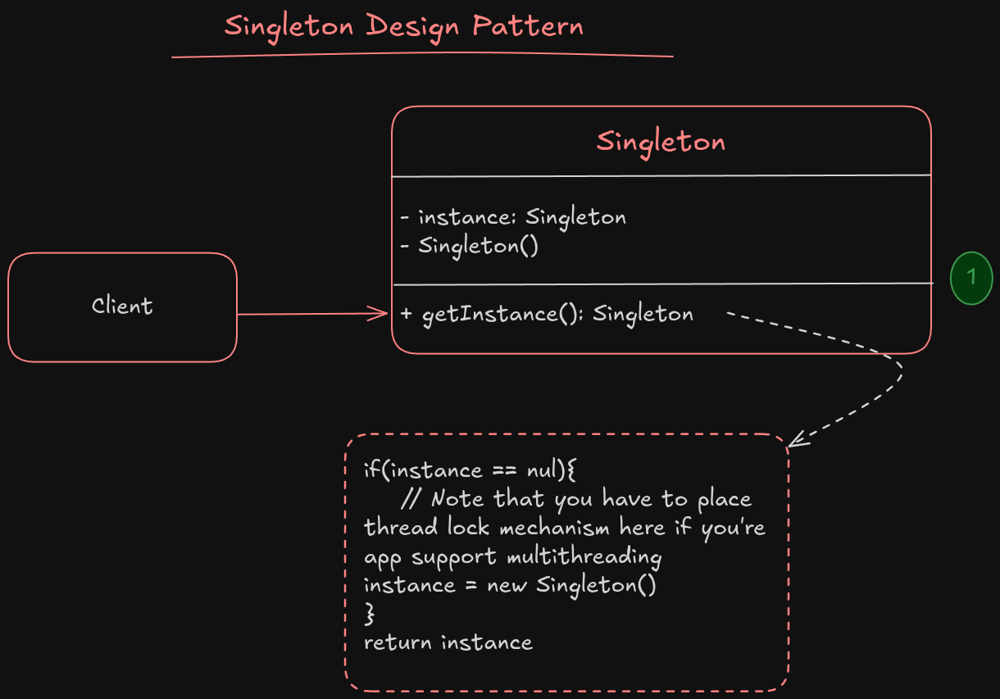

# Singleton

**Singleton** is a creational design pattern that lets you ensure that a class has only one instance, while providing a global access point to it.

> [!CAUTION]
> The **Singleton** pattern solves 2 problem at same time, violating the *Single Responsibility Principle*

1. **Ensures that a class has just a single instance.** But why would anyone want to control how many instances a class has? the most common reason is to control access to the shared resources, such as a **file** or a **database**.
2. **Provide a global access point to that instance.** Just like a Global variable, the singleton pattern lets you access the object from anywhere of a program, But it protect the object by being override by another code.

## How to implement it?

All implementation of singleton pattern has these 2 steps at least:

1. Make the default constructor **private**, so others could not access it for create a new instance using the `new` operator
2. Create a static creation method that acts as a constructor, under the hood this method call the private constructor to create an object and save it in a static field. All following call to this method will return the cached object.

## Structure

1. The singleton class define the static `getInstance` method that returns the same instance of its own class
The singleton constructor should be hidden from the client code. Calling the `getInstance` method **should be the only way** of getting Singleton object.

### Applicability

1. Use the singleton pattern when your class should only have one instance in all of the program, such as Database connections.
2. Use the singleton pattern when you want to have a stricter control over the global variables. This pattern guarantees that only Singleton class can change the instance and no one else can't change oject fields in the hole scope of the program.

### Implementation in detail

1. Add a private static field for caching the instance
2. Declare a public static creation method for getting the singleton instance
3. Implement "lazy" initialization inside the static method. Means it should create a new instance when the cache is empty and return the cache for the following calls
4. Make the constructor private. The static method of the class can call the constructor, but not every one else can
5. Go over the client code and replace the refrences to creating the singleton object with calling the static creation method

#### Pros

- You can be sure there is only one instace always
- You gain a global access point to that instance
- The singleton object is initialized only when it's requested for the first time

#### Cons

- Violate the *Single Responsibility Principle*, The pattern solve 2 problems at once
- The singleton pattern can mask bad design, when the components know too much about each other
- The pattern requires special threatment in multithreading, and multiple threads could not create a singleton object several times
- It may be difficult to test, because mocking the singleton class needs a creative solutions due to limited access to the constructor method
