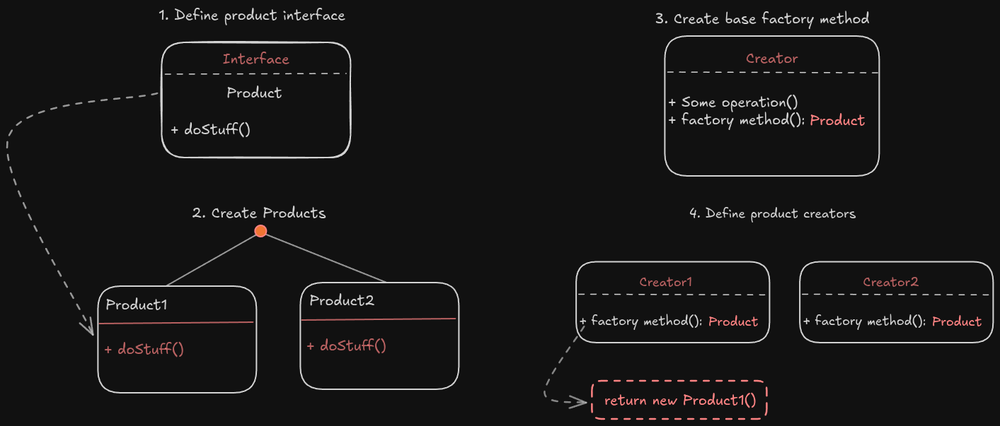

# Factory Method

**Factory method** is a creational design pattern that provides an interface for creating objects in a superclass, but allows subclasses to alter the type of objects that will be created.

> [!NOTE]
> The `Factory method` design pattern suggest you to replace initialize instances by a factory method, instead of initialize it by your own.
> The objects will be initialized using `new()` method like before, but the factory method is responsible for make them instead of you.
> Objects that will be returned by factory method, will be named as `products`.

By using Factory method design patterns, you let the factory create the product for you, that all products have some same features and methods, and then you will use them in your program.

## Example:

Imagine that you want to have a program that move some passengers using some vehicle. At the beginnig, the size of company is little and you just move passengers using cars:

```python
class Car:
    def move_passenger(self):
        print("Move passenger from point A to point B using car")

vehicle = Car()
vehicle.move_passenger()
```

After a while, your company wants to move passengers using train as well, but you have to redefine the source code, because you just programmed for moving passengers using cars:

```python
class Car:
    def move_passenger(self):
        print("Move passenger from point A to point B using car")


class Train:
    def move_passenger(self):
        print("Move passenger from point A to point B using train")

vehicle_type = "train"
if vehicle_type == "car":
    vehicle = Car()
elif vehicle_type == "train":
    vehicle = Train()

vehicle.move_passenger()
```

If after a while, the company decide to move passengers using plans, the source code will become pretty mess. But lets use Factory Method:

```python
from abc import ABC, abstractmethod

class Creator(ABC):
    @abstractmethod
    def facory_method(self) -> Vehicle:
        pass

    def new_travel(self) -> str:
        """
        Also note that, despite its name, the Creator's primary responsibility
        is not creating products. Usually, it contains some core business logic
        that relies on Product objects, returned by the factory method.
        Subclasses can indirectly change that business logic by overriding the
        factory method and returning a different type of product from it.
        """
        product = self.factory_method()
        result = f"New travel: {product.move_passenger()}"
        return result

class CarCreator(Creator):
    def factory_method(self) -> Vehicle:
        return CarVehicle()

class TrainCreator(Creator):
    def factory_method(self) -> Vehicle:
        return TrainVehicle()

class Vehicle(ABC):
    @abstractmethod
    def move_passenger(self):
        pass

class CarVehicle(Vehicle):
    def move_passenger(self):
        print("Move passenger from point A to point B using car")

class TrainVehicle(Vehicle):
    def move_passenger(self):
        print("Move passenger from point A to point B using train")

def client_method(creator: Creator):
    print(creator.new_travel())

if __name__ == "__main__":
    client_method(CarCreator())
    client_method(TrainCreator())
```

output:

```txt
New travel: Move passenger from point A to point B using car
New travel: Move passenger from point A to point B using train
```

### Structure:

1. You have to declare your `product interface` that is shared with all objects that can be use by creator and subclasses.
2. Then define your different type of products, with implementing the `product interface`.
3. The `Creator` class declare the `factory method` that will return new instance of product, it's important that the return object from this method, **match the product interface**.

> [!TIP]
> You can make the factory method as abstract method which means that all subclasses are forced to implement their own fatory method
> You can also return default product type in main factory method, instead of leaving it blank

> [!IMPORTANT]
> Despite it's name, the `Creator` main responsibility in not to create product. The Creator could have many different methods that are decoupled from different types of product, *That usually are core bussiness logic related to products*. The factory method helps to decouple them from product classes

4. `Concrete creators` override the base factory method from Creator, so it can return different type of products.

> [!NOTE]
> The factory method isn't forced to create new instance all the time, it can use cache or return existing object instead of creating new one.



#### Applicability

- Use factory method when you don't know beforehand and exact types, methods and dependencies that your object needs and your code should work with.
- Use the factory method on build scalable frameworks or libraries, that you want to extend it by your own or someone else will do it
- Use the factory method when you want to improve performance and save system resources by reusing the existing object instead of initialize new one each time

#### How to implement?

1. Make all products follow the same interface.
2. Add an empty factory method inside the creator class. The return type of this method should implement the product interface.
3. In the creator's code, find all the refrences to product constructors. Then replace them with call to the factory method, while extracting the product creation code into the factory method.
4. Now, create a set of subclasses for each product, that inherit from base creator, and then override the factory method for each of them and put appropriate bits of constructions for that specific product.
5. If there are many product that it seems not good to create a creator for every each of them, then you can couple some of them by using `switch`.
6. If after all the subclasses initialization, the factory method become empty, you can make it abstract and if there's something left, you can make it as a default behavior.

##### Advantages

- Decouple object creation from its usage
- Easier to manage and scale as new type definition
- Improve code maintainability
- Promotes `Open/Closed` and `Single Responsibility` principles

##### Drawbacks

- Can introduce **unnecessary complexity**
- May lead to large number of creator classes

###### When to use?

- **Database driver factory**: When switching between different db clients, PostgreSQL, MySQL, etc.
- **UI component factory**: when building dynamic forms or UI elements
- **Logger factory**: Depenfing on environment, log to file, console, or remote.
- **Notification factory**: email, SMS, social media push notification bot services
- **Parser factory**: XML, JSON, YAML parsers
- **Game development**: enemies, items or character factory depending on level or environment.

###### Sources:
- [Factory Method](https://refactoring.guru/design-patterns/factory-method)
- [Factory Method - Python example](https://refactoring.guru/design-patterns/factory-method/python/example)
- [Factory Method - Go example](https://refactoring.guru/design-patterns/factory-method/go/example)