# Design Patterns

[](https://amirmahdikahdouii.github.io/Design-Patterns/)

> **Reading options:** Browse this repository on the `master` branch for plain Markdown files, or visit the [published Hugo site](https://amirmahdikahdouii.github.io/Design-Patterns/) for a searchable documentation experience.

In this repository that include `code + documents`, I share my study about design patterns and what I have found and learnd.

Generally design patterns are classified in 3 main class:

1. Creational patterns
2. Structural patterns
3. Behavioral patterns

## Source:

- [refacoring.guru](https://refactoring.guru/design-patterns/catalog)

### Creational Patterns

Creational patterns provide various object creation mechanisms, which increase flexibility and reuse of existing code.

- [Factory Method](./Creational-Patterns/Factory-Method/README.md)
- [Abstract Factory](./Creational-Patterns/Abstract-Factory/README.md)
- [Builder](./Creational-Patterns/Builder/README.md)
- [Prototype](./Creational-Patterns/Prototype/README.md)
- [singleton](./Creational-Patterns/Singleton/README.md)

### Structural Patterns

Structural patterns explain how to assemble objects and classes into larger structures, while keeping this structures flexible and efficient.

## OOP basics

Object Oriented Programming (OOP), is based on 4 pillars, concepts that differentiate it from other programming paradigms.

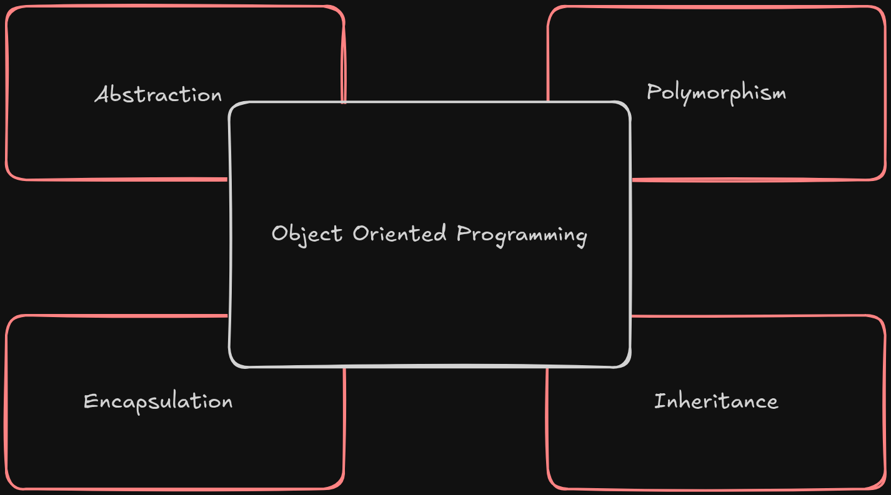

1. **Abstraction**: Abstraction is a model of real world object or phenomenon, limited to a specific context, which represents all details relevant to this context with high accuracy and omit all the rest.
2. **Encapsulation**: Encapsulation is the ability of an object to hide parts of its state and behaviors from other objects, exposing only a limited `interface` to the rest of the program. Encapsulate something means to make it `private` for the class, to only be accessible from the methods of that class locally. There is a little bit less restrictive mode called `protected` that makes a member of a class available to subclasses as well. Interfaces and abstract classes or methods in most of programming language are based on `Abstraction` and `Encapsulation` concepts. Interfaces only care about the behavior of an object, and due to this, only methods are defined in interfaces, not the fields.
3. **Inheritance**: Inheritance is the ability to build new classes on top of existing ones. The mean benefit of inheritance is code reuse, because you can use existing class with all methods and attributes, and define new methods and declare new attribute on top of existing one, without duplicating code and use existing code from super class. The consequence of using inheritance is that subclass is implementing the interface that super class do, because subclass cannot hide the existing method in super class. **Also you have to define all abstract methods that are marked as abstract method in super class.** In most programming languages subclass can only extend one superclass, and on the other hand, a class could implement one or more interfaces at once.
4. **Polymorphism**: Polymorphism is the ability of a program to detect the real class of an object and call its implementation even when its real type is unknown in the current context.

## Relations between objects

1. **Association**: Association is a type of relationship in which one object uses or interacts with another. Generally you use association to represent something like a field in a class. For example the relationship with an order with it's related customer.
2. **Dependency**: Dependency is a weaker variant of association that usually implies that there's no permanent link between objects. Dependency (Usually bot not always) means that one object accept another object as a method parameter, instantiate or use another object. A dependency exists between two classes if changes on one class result in modifications in another class.
3. **Composition**: Composition is a relationship between two objects, that one of them act as a container and the other/others play role of components. The difference between this relation with others is that the component only exists as a part of container.
4. **Aggregation**: Aggregation is a less strict variant of composition where one object merely contains a reference to another. The container does't control the lifecycle of the component. The component also can exists without the container and can be linked to several containers at the same time.

Below is the UML diagram of each relationship and also how we represent them in UML:

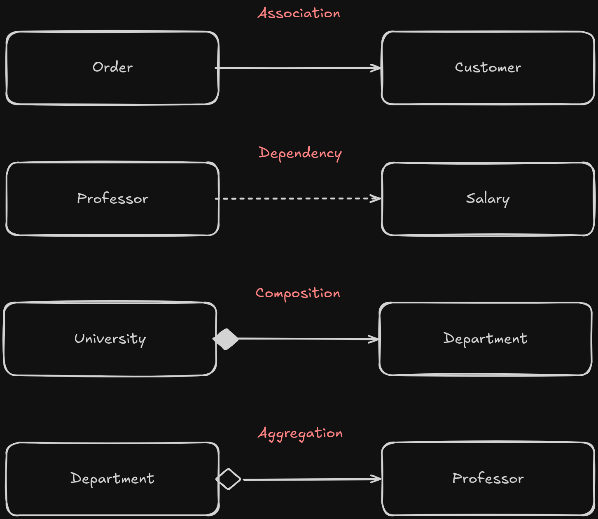

## What is a design pattern?

**Design Patterns** are solutions to common problems that occur in software design. They're like blueprints that let you customization and solve a recurring problem in the code.

You cannot copy and paste a pattern into your existing code, instead you have to modify them by your own! Design patterns are some concepts that let you think for solving problems in a structural way.

> [!NOTE]
> Patterns are often confused with algorithms, but algorithm is a set of structure that you have to apply them in that specific way to solve the common problem, but patterns are high-level concepts that get customized to solve a problem, by the way the developer implement them.

### Design patterns classification

1. **Creational Patterns**: Creational patterns provide object creation mechanisms that increase flexibility and reuse of existing code.
2. **Structural Patterns**: Structural patterns explain how to struct and assemble objects and classes into larger structure, while keeping it flexible and efficient.
3. **Behavioral Patterns**: Behavioral patterns take care of effective communication and the assignment of responsibilities between objects.

#### Features of good design

1. **Code reuse**
2. **Extensibility**

### Design Principles

#### Encapsulate what varies

Identify which part of your application vary from another and separate them from what stays the same. The main goal of this principle is to reduce the cost on changes the code. **The less time you spend on making the change, the more time you have to implement new features**.

##### Encapsulation in a method level

As an example, imagine that there is a method for calculate the order price including tax. Taxes can be differ due to the location of the customer or changes in regulation later, so put the calculation logic into the method that calculate prices, may not be a good idea.

```text
method getOrderTotal(order) is
    total = 0
    foreach item in order.lineItems
        total += item.price * item.quantity
    
    if (order.country == "US")
        total += total * 0.07 // US sales tax
    else if (order.country == "EU"):
        total += total * 0.20 // European VAT
    return total
```

What we do here is to separate the calculation tax logic into a separate method, and if that method will become more complicated in future, we can separate it into a new class.

```text
method getOrderTotal(order) is
    total = 0
    foreach item in order.lineItems
        total += item.price * item.quantity
    
    total += total * getTaxRate(order.country)
    return total


method getTaxRate(country) is
    if (country == "US")
        return 0.07 // US sales tax
    else if (country == "EU")
        return 0.20 // European VAT
    else
        return 0
```

##### Encapsulation in a class level

We can simply make a new tax calculator class for handling tax calculation, because tax calculation could be complicated to handle in a method in `Order` class. Then we make a aggregation between **Order** and **TaxCalculator** class, and TaxCalculator class would have some private method to calculate taxes for different countries or states.

> [!NOTE]
> Program to an interface not an implementation. Depend on abstractions, not on concrete classes.
> You can tell that a design in flexible enough if you can easily extend it without breaking any existing code.

### Setting up collaboration between classes

If you want to create collaboration between 2 classes, you can follow these steps:

1. Determine what exactly one object needs from the other: which methods does it execute?
2. Describe these methods in a new interface or abstract class.
3. Make the class that is a dependency implement this interface.
4. Now make the second class dependent on this interface rather than on the concrete class. You still can make it work with objects of the original class, but the connection is now much more flexible.

> [!NOTE]
> What I've been notice is that when we're trying to create a subclass, we have to ask ourself that is this class coupled with any other classes or not?
> If answer to that question would be **yes**, then we have to try to remove this coupling between classes, and make them independent from each other.
> For example, imagine that we have a company class, that some employees work for this company. If we create a new instance from this company, then assign some employee to it and try to iterate on this employees and call the `doWork()` method, we have coupling between employee class and also company. The better solution would be to create a new `abstract method` for **Company super class**, and try to implement this in different subclasses, and by achieving this, we'll remove coupling between company and employees.

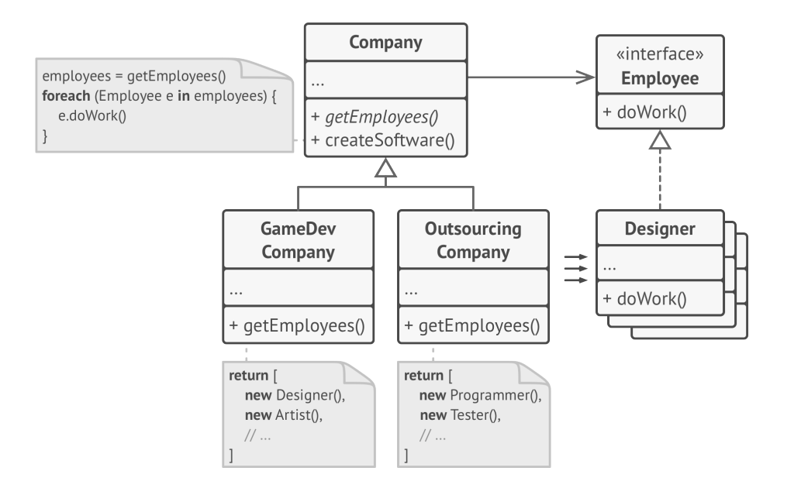

### Favor composition over Inheritance

#### Cons of inheritance

1. A subclass can't reduce the interface of superclass
2. When override methods, you have to make sure that the new behavior matches and it's compatible with the base one.
3. Inheritance breaks the encapsulation of the superclass, because the methods and fields of superclass are available in subclass either.
4. Subclasses are tightly coupled to the superclasses: any change in the super class may cause an error in subclasses.
5. Trying to reuse code through inheritance can lead to creating parallel inheritance hierarchies.

#### Composition

There is an alternative to inheritance called **Composition**. The inheritance represent a `is a` relationship **(A Car is a transport)**, while composition represent a `has a` relationship **(A Car has an engine)**.

This principle also applies to **aggregation**, a more relaxed variant of composition where one object may have a reference to the other one, but doesn't manage its lifecycle. *A car has a driver*: But the driver may use another car or prefer to walk instead of driving!

- **Inheritance explosion:**

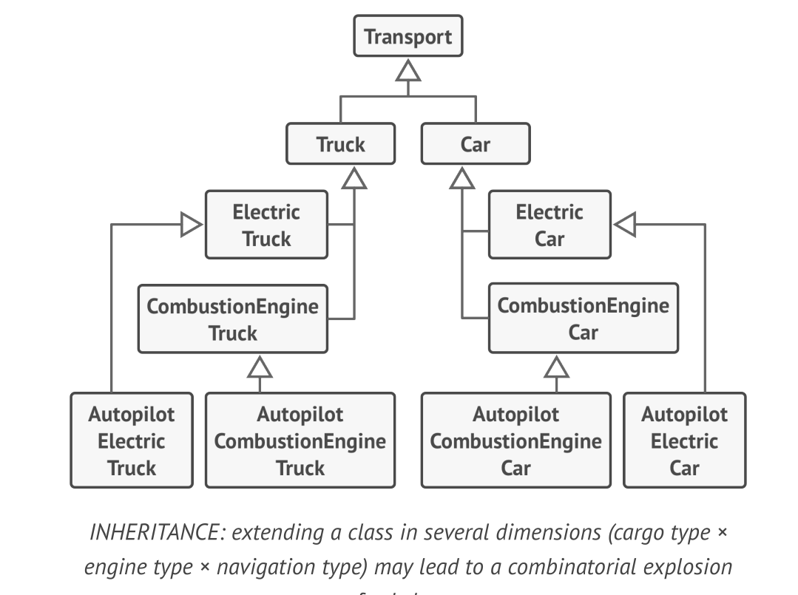

- **Composition over inheritance:**

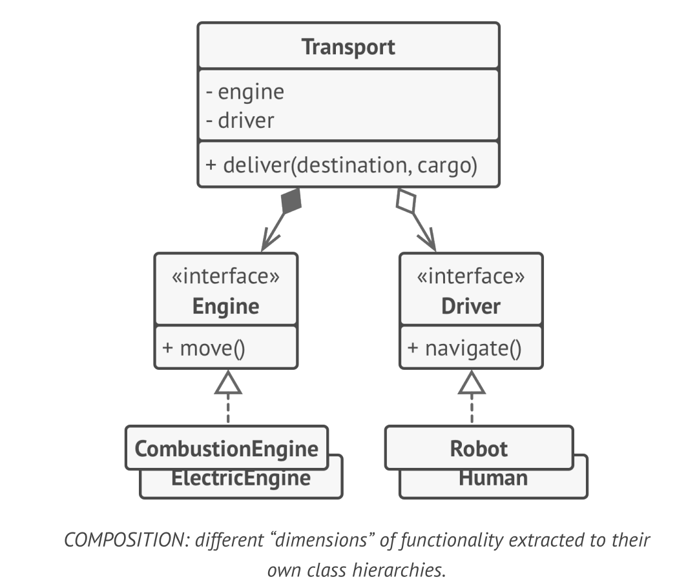

## Solid Principles

Solid in the mnemonic for five design principles introduced by **Robert martin** to make softwares more unerstandable, maintainable and flexible for changes in future.

> [!IMPORTANT]
> As with everything in life, applying all these principls once at a time into a program might not be a good option, because it makes the code complicated as it was before. Knowing these principles and applying or use them base on your need in a program and software design, could be helpful and effective, so be a pragmatic and use them base on your needs!

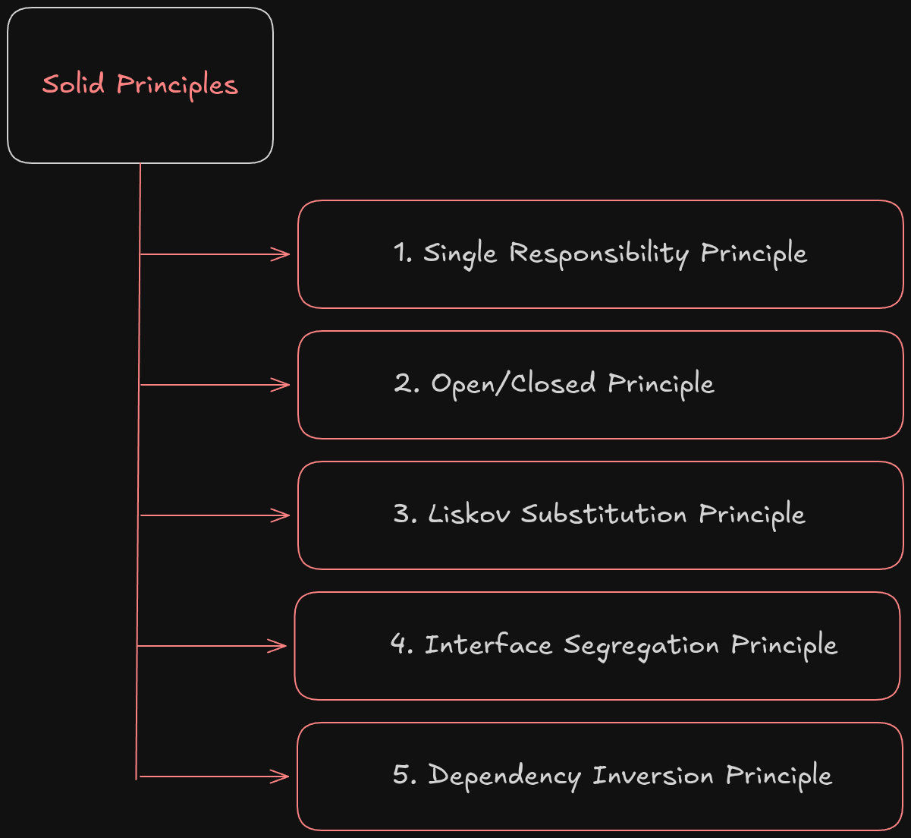

### 1. Single Responsibility Principle

> **A class should have just one reason to change**

Try to make every class responsible for a single part of the functionality provided by the software, then make that responsibility encapsulated entirely by a class.
The main goal of this principle is to reduce complexity. 

When your program is about 200 lines of code, you don't need this priniple, but as the program grow, and code design is getting bigger and more complicated as before, using this principle will help you manage different part of the application easily. When classes become so big that you can't remmember its details, and you have to crawl on code to find a specific funcationality, this principle is coming for help you and it will get your control over the code back to you.

### 2. Open/Closed principle

> **A class should be open for extention but close for modification**

The main idea of this principle is to keep existing code from breaking when you implement a new feature.

A class is *Open* if you can extend it, means make a new subclass from superclass and modify it as you want, add new methods based on your needs.
A class is *Closed* if its 100% ready to be used by other classes, means it has a clear interface and it won't be changed in future.

If a class is already developed, tested, reviewed and included in some framework or app, trying to change the code in the class it's risky, because it can cause of future issue in where it's used. Instead, its recommended that create a subclass from that class and implement new features in that, then use this subclass to avoid future issues.

> [!CAUTION]
> This principle isn't meant to be applied for all changes to a class. If a class has a bug, just go and fix it as soon as possible. Don't fix bugs in subclasses, the subclasses are not responsible of a parent issues.

### 3. Liskov substitution principle

- Where this principle come from?: [Link](https://refactoring.guru/liskov/dah)

> **When extending a class, remeber that you should be able to pass the object of the subclass in place of objects of a parent class without breaking the client code**

The behavior of the subclass should remain compatible with actual behavior of parent class. Means that if you're override an existing method from parent class, the default behavior of method should not be changed totally, and you have just extend the behavior.

This subsitution princiiple is a set of checks that provide intergrity after changes on class, to avoid problems in future, where this class is used by codes and project that you haven't access to modify them.

This principle has some checklist unlike any other principles, to help you extend your methods in a subclass:

- [ ] Parameter types in a method of a subclass should match or be more abstract than parameter type of the superclass

For example, if you have a method for feeding cats, lets say: `feed(Cat c)`, and you want to extend this method in a subclass you can do these:

- **Good Option**: You can modify the type of parameter to a superclass of **Cat**, lets say `Animal`. So, your new modified method in subclass would be `feed(Animal a)`, and that won't raise any exception, Because the previous codes that pass an instance of `Cat`, would work here, because `Cat` is a subclass of a `Animal` superclass, and the new codes that pass any object that has the interface of `Animal`, would work here!

- **Bad Option**: You limit the parameter type from `Cat` to a specific type of cats, lets say `BengalCat`. so the modified method is `feed(BengalCat c)`. This would raise exceptions because th Bengal cats could not implement the Cat interface, or if they can, the previous codes that pass `Cat` instances to this method, should all get modify! *(An impossible mission)*

- [ ] The return type in a method of the subclass should match or be a subtype of a return type in of a method in superclass

If you have a method to `buyCat(): Cat`, and you want to change the return type of it in a subclass, you have 2 options:

- **Good Option**: You can modify the return type of this method like this `buyCat(): BengalCat`. This is a good modification, because `BengalCat` is a subclass of parent `Cat` class. The client code would not break because the Bengal Cat is still a Cat and modify its interface.

- **Bad Option**: You can modify the return type like this: `buyCat(): Animal`. By doing this, the client code could face problems, because it doesn't know the return type is still a cat or it would face a bear? This is not a good implementation of this method in subclass, because it could raise exceptions in client code.

- [ ] A method of a subclass shouldn't throw types of exceptions which the base method isn't expected to throw

Types of exceptions should match or be the subtype of the ones that base method throw, because in client code, `try-catch` blocks expect some exceptions and if your new modified method return something else, it couldn't catch by the block and crash the entire application.

- [ ] A subclass shouldn't strengthen pre-conditions

As an example, if you get an `int` number as a prameter in a base method, you cannot modify a condition in a subclass to only get positive numbers, and throw exceptions if given number was negative, because the client code that pass negetive number to this method and it worked fine, now by using this subclass would break and crash. Because you throw an exception if given number was negative.

- [ ] A subclass shouldn't weaken post-conditions

If you have a class that works with database and it close connection after any method calling, and you create a subclass and break this rule, and keep the connection open after a method job done, for reusing it in next method calls, and client code doesn't know about this new rule and it not close the connection manually, after running application, the computer and database will have a ghost `(idle)` connection.

- [ ] Invariant of a superclass must be preserved

Invariant of a super class should get touch in subclass, because it may be used in different client codes, unit tests, methods and so on. If your class size is large, it's better not to touch invariant fields and methods even if they seems useless, Because maybe they're used by different methods or client codes and tests, that your change could cause unexpected issues. **The better choice is to declare new fields and methods and work with them.**

- [ ] A subclass shouldn't change values of private fields of the super class

In 2 next shots, we will face an bad design and good design of modify methods in a subclass for this check item:

- Bad Design:

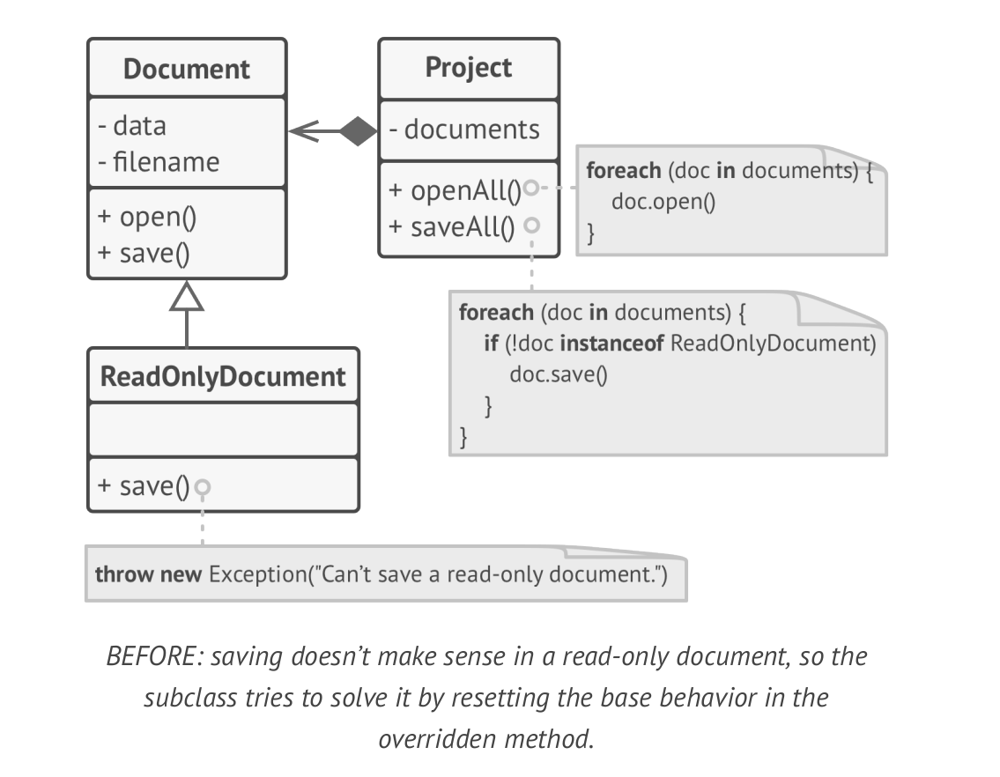

- Good Design:

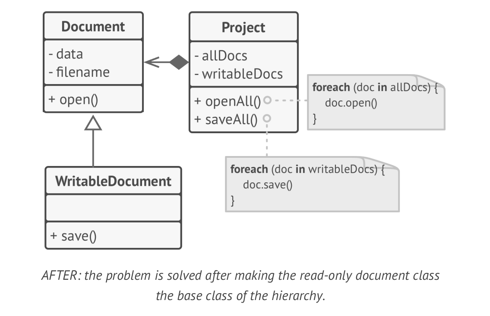

### 4. Interface segregation principle

> **Clients shouldn't be forced to depend on methods they do not use**

According to the **interface segregation principle**, you have to break down fat interfaces into more granular and specific ones. Clients should implement only those methods that they really need. Otherwise a change in fat interface would break even clients that don't use the changed method. 

> [!NOTE]
> Class inheritance lets a class have just one superclass, but it doesn't limit the number of interfaces that the class can implement at the same time.
> So there is no need to put tons of methods in a single interface, that are not really related to each other, instead you can segregate interfaces and group methods that are related to each other in a single interface.

Below, we have an example of fat interface:

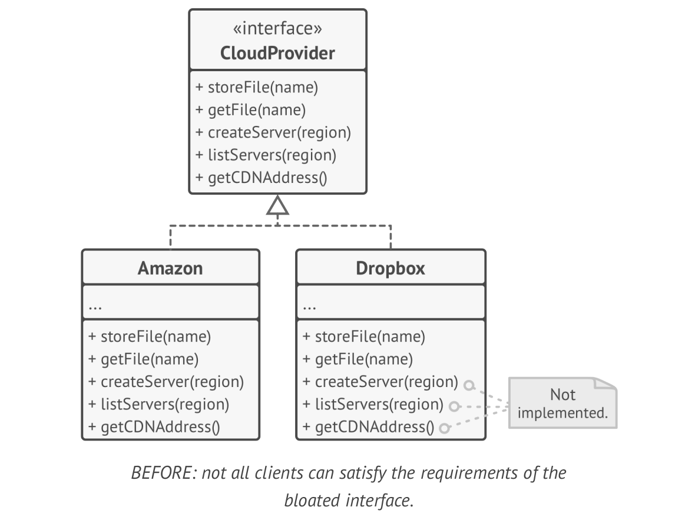

In this example, the **Dropbox provider** have to implement the unnecessary methods, and even it it declare it empty, it is not pretty enough. Now lets break down the interface to some little ones:

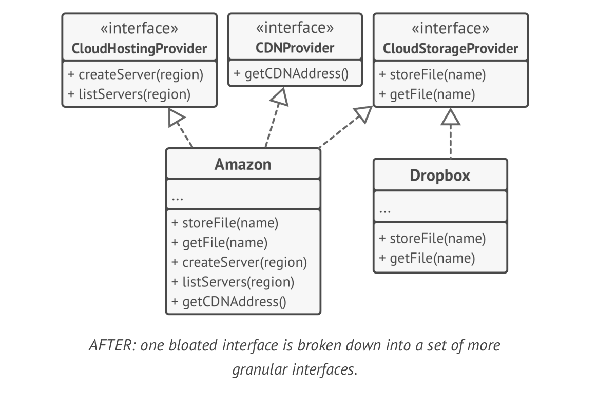

By doing this, the *Dropbox provider* have to implement those methods that are only for storing data in cloud storage.

> [!CAUTION]
> Remember that the more interfaces you create, the more complex your code becomes, so keep the balance

### 5. Dependency inversion principle

> **High level classes shouldn't depend on low level classes. Both should depend on abstractions. Abstractions shouldn't depend on details. Details should depend on abstractions**

Lets make our definition from high-level and low-level classes clearly:

- **Low-Level classes** implement the basic operations such as *transfering data over network*, *working with a disk*, *connecting to the database*
- **High-Level classes** contains complex business logic that directs low level classes to something

Sometimes people start project by working on low level classes, because you're not sure what's possible at higher level, and after that start to build higher level classes.
With such an approach business logic classes tend to become dependent on primitive low-level classes.

The **Dependency Inversion Principle** suggest changing direction of this implementation!

1. First, you have to implement the interface for low level classes. For example if you need a `saveDocument(x)` method, you have to declare this in low level class interface, because the high level class job is not to call these methods `openFile(x)`, `readBytes(n)` and `closeFile(x)`. 
2. Now you can make high level class dependent on these implemented interfaces, instead of concrete low level classes. This dependency will become much softer than the origianl one.
3. Once low-level classes implement these interfaces, they become dependent to the high-level class or business logic, and reversing the direction of the original dependency.

> [!NOTE]
> The dependency inversion goes along with **Open/Closed principle**: you can extend low level classes without breaking existing classes.

Below is an example of high level class depends on low level class:

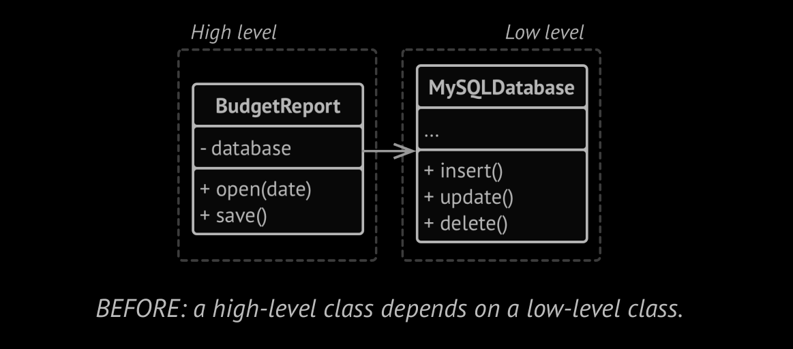

This dependency is not good, because if we want to switch our database, we have to make changes in `BudgetReport` class either.

The dependency inversion principle recommend this implementation:

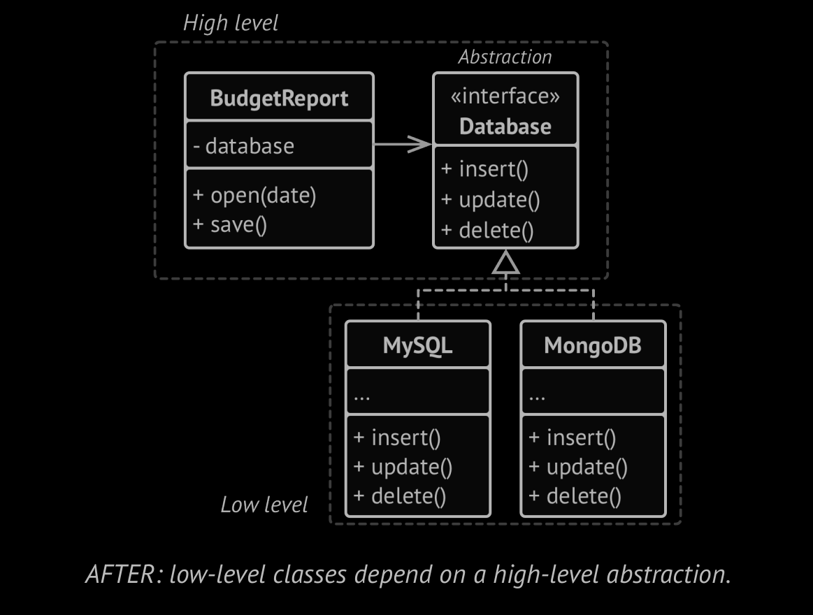

Now, If we want to use another database, we have just make its class that impelement the `Database` interface.
