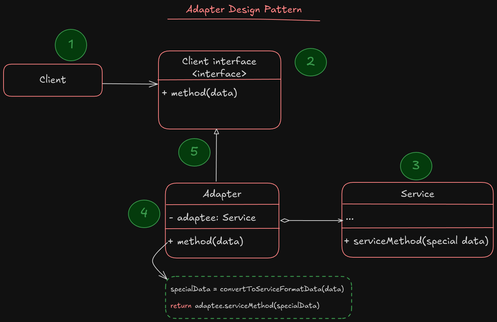
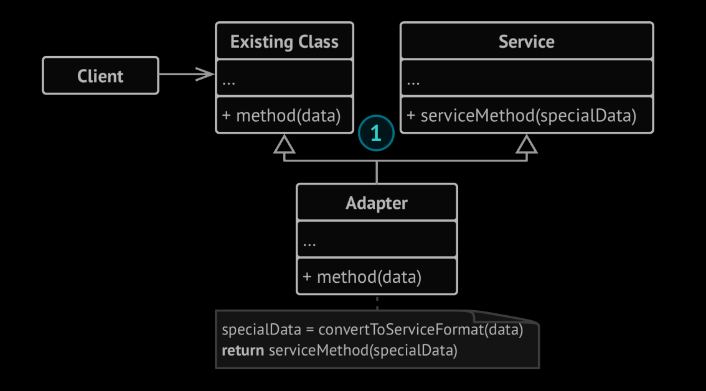

# Adapter

**Adapter** is a structural design pattern that allows object with incompatible interfaces to collaborate.

Imagine that you have a type of data, for example `XML` data that you want to convert it into `JSON` to be used by a third-party-application. To achieve this `Adapter` will be helpful for us.

**Adapter** is a special object that converts the interface of one object so that another object can understand it.

An adapter will hide the complexity of conversion between different objects behinde the scenes. Adapter can not only convert data into various formats but can also be helpful with different interfaces to collaborate with eachother.

1. The adapter implements an existing interface that is compatible with existing object
2. Using this interface, the existing code can safely call the adapter methods
3. When adapter receive a call, it convert it to the format that would be understandable for second object and the call the second object with converted data

> [!TIP]
> Sometimes its even possible to create a 2 way adapter that converts data in both directions

> [!NOTE]
> The `Adapter` is somehow coming from different shape of power plugs in different continents or even countries.
> If you're american and you travel to Germany for a trip and you want to charge your phone or device, you'll need a convertor device (an adapter) to receive your charger plug in and then you can plug the adapter to the socket.
> Your problem is solved by an adapter that has US style socket and European style plug.

## Structure

1. The **Client** code is where the business logics exists
2. The **Client interface** is an interface that every class who wants to be used by client code must implement it
3. The **Service** is some useful class (usually 3rd-party), and the client can't use this class directly due to it's incompatible interface
4. The **Adapter** is where the client is able to interact with service. The adapter implement the client interface, and wrap the service so the client call call the adapter and adapter convert it calls to the format that the service class needs
5. The client code doesn't get coupled to the concrete adapter class as long as it works with the adapter via client interface. Thanks to this, you can implement new types of adapters into the program without breaking the existing client code. This would be useful when the interface of the service class gets changed or replaced: you can just create a new adapter that work with the new service interface

Also there is an approach when in a programming language is allowed to have inheritance from multiple parent classes. The Adapter could inherit from both client interface and also service interface, so there would be no needs to wrap the service class by it self.

### How to implement?

1. Make sure that you have at least 2 classes with incompatible interfaces, one of them a useful service class which you can't change (like 3rd-party library), and also a several client class that wants to use incompatible service class.
2. Declare the client interface and define how client should interact with services
3. Create the adaptor class which implement the client interface, and leave all methods empty
4. Add a field to the adaptor class to store the service refrence object. The common practice is to initialize this field via the constructor, but sometimes it's ok to pass it to the adaptor when calling its methods
5. One by one implement the client interface methods, the adaptor class should deligate most of the real work to the service object, handling only the interface implementation or data conversion
6. Clients should use the adaptor via the client interface. This will decouple the client interface to the adaptor class.

