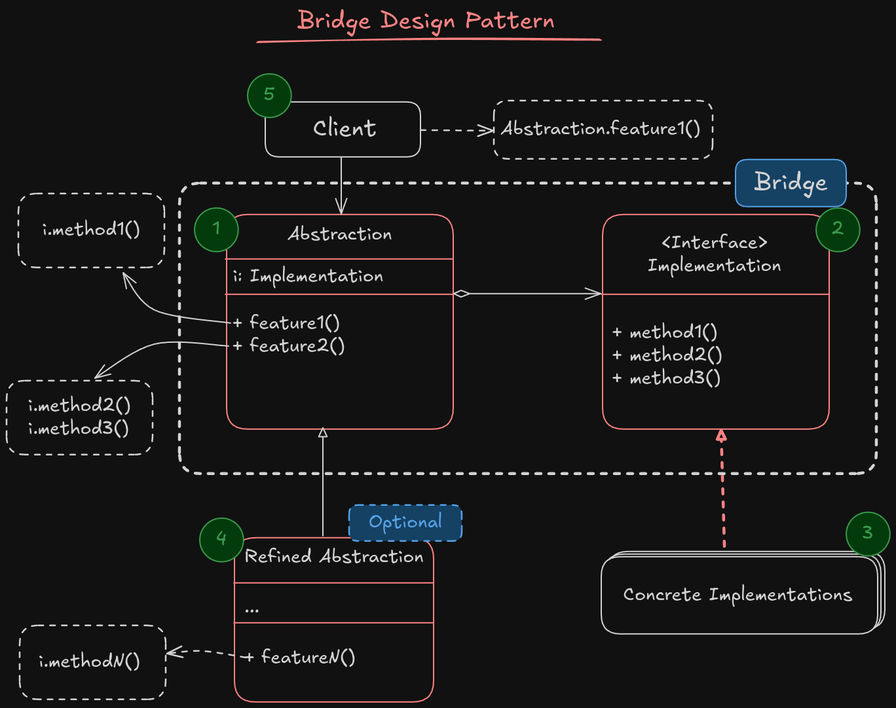

# Bridge

**Bridge** is a structural design pattern that lets you split a large class or a set of closely related classes into two separate **hierarchies-abstraction** and **implementation** which can be developed independently of each other.

## Abstraction and implementation

**Abstraction** (also called interface) is a high level control layer for some entity. This layer isn't supposed to do any work on its own. It should deligate the work to the implementation layer (Also called platform).

For example the *Abstraction* is the **GUI** in real world applications, and implementation is the underlying operating system code (API) which the GUI layer calls in response to user interactions.

Following the example, if you want you can extend the **GUI** interfaces to have different style and theme and also support different operating system APIs which means that it could be Linux, MacOS or Windows.

> [!IMPORTANT]
> Making changes in monolithic codebase is hard and require good understanding of all the different sections of code, which is impossible in large systems. Instead, working and making changes in little services is much easier.

### Implementation



1. The **Abstraction** provides a high-level control logic. It want to relies on implementation to do the actual low level work.
2. The **Implementaion** implement the low level codes that do the actual work that abstraction needs. The **Implementation** is an interface that defines some methods that should be implemented in all concrete implementations. The **Abstraction** would rely on this interface for working with implementation class.
3. **Concrete implementation** contains definition of implementation interface.
4. **Refined abstraction** provides variants of control logic. Like their parent they work with implementation via implementation interface.
5. The **Client** is interested in working with the abstraction. However the client responsibility is to link the abstraction with proper implementation.

> [!NOTE]
> The **Bridge** design pattern responsibility is to decoupling the Interface or abstraction from the Implementation layer.

### Applicability

Use the bridge pattern when you want to devide and organize a monolithic class that has several variants of some functionality(for example if the class can work with various database servers).

The bigger a class becomes, the harder is to make new changes and implement new features. The bridge pattern lets you split a large monolithic class into several class hierarchies. After this you can make changes to a class independently from other classes. This approach simplify the code maintenance and minimize the risk of breaking existing code.

- Use the pattern when you want to extend the class in multiple dimensions.
- Use the bridge pattern if you want to change implementation at runtime.

#### How to implement?

1. Identify the indepentent concepts such as backend/frontend, abstractions/implementations,... in your project.
2. See what operations is need by client code and define them in abstraction class.
3. Determine the operations that are common in all different platforms, declare the ones that are necessary to be used by abstraction class in general implementation interface.
4. For all platforms define the concrete implementation, that they define the implementation interface.
5. Inside the abstraction class, define a field to reference for the implementation.
6. If you have several variants of high-level logic, create refined abstractions for each variant extending the base abstraction class.
7. The client code pass the proper implementation class to the abstraction class, and after that client only have to work with abstraction class without worry to change the implementation class and whats going on under the hood!

##### Pros

- You can create platform independent classes and apps.
- The client code works with high-level abstraction class and don't coupled to low level code.
- *Open/Closed principle*: You can introduce new abstractions and implement it independently from others.
- *Single respopnsiblity principle*: You focus on high-level logic in abstraction class, and deligate the low level implementation to the implementation classes.


##### Cons

- The code would become complicated due to layered architecture.

> [!IMPORTANT]
> **Bridge**, **State**, **Strategy** and some degree of **Adapter** are all based on *Composition*. Composition means deligate work to other objects rather than doing it in our code.
> A pattern isn’t just a recipe for structuring your code in a specific way. It can also communicate to other developers the problem the pattern solves.

---
> [!NOTE]
> Below is some AI generated answer for better understanding from bridge pattern.
---

#### 💡 Classic Example:

Imagine a `RemoteControl` class and a `TV` class:

```go
type TV interface {
    On()
    Off()
    SetChannel(channel int)
}

type RemoteControl struct {
    device TV
}

func (r *RemoteControl) TurnOn() {
    r.device.On()
}
```

Here, the `RemoteControl` is decoupled from the specific type of `TV`. You can have `SonyTV`, `LGTV`, etc., and you don't need to change `RemoteControl` logic.

---

## ✅ How Bridge Pattern Improves **Quality of Service (QoS)**

1. ### **Scalability**

   * Abstraction and implementation can grow **independently**.
   * You don’t have to multiply classes (e.g., `SonyRemote`, `SamsungRemote`, `SonyAdvancedRemote`, etc.)

2. ### **Maintainability**

   * Clean separation of concerns.
   * Changes in implementation don’t affect the abstraction and vice versa.

3. ### **Flexibility & Extensibility**

   * Easy to extend functionality without modifying core classes.
   * Supports the **Open/Closed Principle**.

4. ### **Reduced Coupling**

   * Helps avoid tight coupling between components, which improves system reliability and testability.

---

## 🌍 Real-World Use Cases

1. ### **UI Frameworks (e.g., Java Swing, Qt)**

   * You have widgets (abstractions) like `Button`, `TextField` that work on **different operating systems** (implementations like Windows, Linux, macOS).
   * The Bridge pattern separates **UI logic** from **platform-specific drawing**.

2. ### **Remote Control & Devices**

   * Universal remote working with different brands of devices.
   * Remote is abstraction; device is implementation.

3. ### **Database Drivers**

   * Your app may use a `Database` interface and support multiple databases like MySQL, PostgreSQL, SQLite. Implementation varies, abstraction remains.

4. ### **Document Readers**

   * A PDF viewer may work on multiple platforms (Android, iOS, Windows). Rendering engine is abstracted from the UI logic.

---

## 🔄 Is Bridge Pattern Just "Another Pattern"?

| Pattern              | Similarity                                | Key Difference                                                               |
| -------------------- | ----------------------------------------- | ---------------------------------------------------------------------------- |
| **Adapter**          | Decouples interface and implementation    | Adapter changes an existing interface to match another                       |
| **Strategy**         | Chooses implementation at runtime         | Strategy is behavior-focused; Bridge is structure-focused                    |
| **Decorator**        | Adds features to objects                  | Decorator wraps; Bridge separates abstraction/implementation                 |
| **Abstract Factory** | Can also create different implementations | Abstract Factory is about object creation; Bridge is about decoupling layers |

> ✅ **Bridge** is distinct in that it allows **independent development and extensibility** of abstraction and implementation layers — which is crucial in systems that need **high flexibility and long-term maintainability**.
