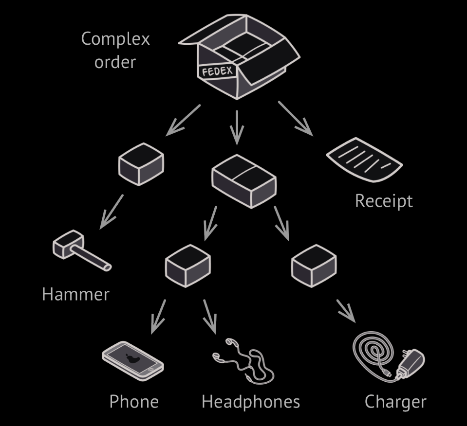
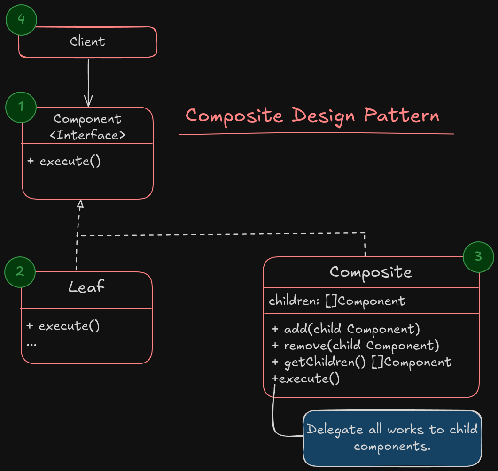

# Composite Design pattern

**Composite** is a structural design pattern that lets you compose objects into tree structures and then work with these structures as if they were individual objects.

> [!IMPORTANT]
> Using the composite pattern make sence only when the core model of your app can be represented as a tree.

For example imagine that you have 2 different types: `box` and `product`.
Each box can contains some product and also some little boxes that can fit and placed in bigger boxes, which each of them could contains some little products as well!

Now you want to create an ordering system that should calculate the total price and then return it to the payment system. How could you handle this?

The direct approach is to calculate each product price directly, but here is the problem, *does every product follow a same interface for returning the price?*
The Other issue is you don't know how much loops you have to implement for calculate the little inner boxes!

**The Composite pattern suggest that you works with `Products` and `Boxes` through a same interface which have a method for calculate the total price.**

For a `product` this method return the price and for a `box` it will go through each product and box and return the sum of prices.

> [!NOTE]
> The composite pattern allows you to run a behavior recursively over all components of an object tree.

## Structure

1. The **Component Interface** describes operations that are common to both simple and complex elements of the tree.
2. The **Leaf** is the basic element of a tree that doesn't have any children. Usually the leaf components end up doing the real works, since they don't have any children.
3. The Container *(AKA composite)* is an element that has sub-elements: leaves or other containers. A container doesn't know about the concrete class of its children and it works with them only via Component interface. When an request comes. containers delegate the work to children and then return the calculated result.
4. The client works with all elements through the component interface. As a result, the client can work in the same way with both simple or complex objects of the tree.

### Applicability

- Use the composite pattern when you're dealing with tree like objects.
- Use the pattern when you want the client code treat both simple and complex components

#### How to implement?

1. Make sure that the core model of your application can be represented as a tree structure. Try to create simple components and containers out of them. Remember containers must be able to contain both simple component and container.
2. Create component interface that has list of methods are common for both container and simple components.
3. Create a leaf class to represent the simple component. A program may have multiple different leaf class.
4. Create a container class to represent complex elements. In this class provide an array field for placing the refrences to sub elements. The array must be able to store both leaf and containers so it would have the interface type. Keep in mind that most of the works should delegate to the leaves not containers!
5. Finally add mehtods for add and remove child from array of sub-elements, these also can implement in component interface but it would violate the *Interface Segregation Principle* which these methods leave empty in leaf classes.

#### Pros

- You can work with complex tree structures, use polymorphism and recursion.
- *Open/Closed Principle*. You can introduce new elements into the app without breaking the existing code.

#### Cons

- It might be difficult to define a same interface to be shared across all the leaf and containers
