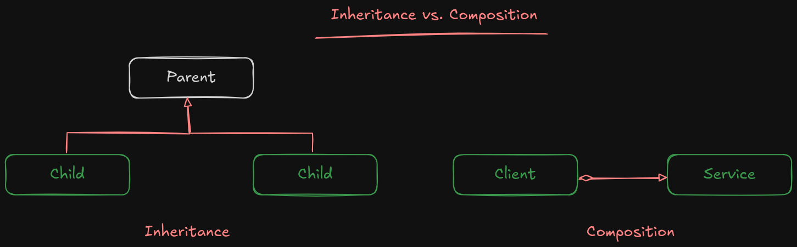
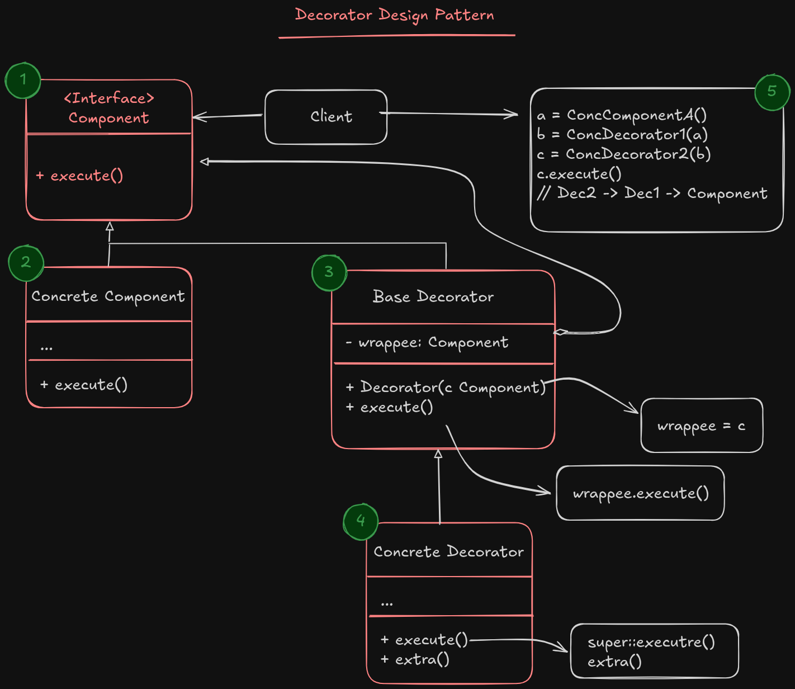

# Decorator design pattern

**Decorator** is a structural design pattern that lets you attach new behaviors into objects by placing these objects inside a wrapper objects that contains the behavior.

Imagine that you have an object that do something, but you need to add some extra feature to that object without refactoring the actual object. In this ccase one approach is to use *Composite* which allows you to attach that object to new object, and your composite will do your needs. Another Approach which we'll cover in this doc is create a wrapper object named **Decorator** and place the main object in that wrapper, and the client code will work with this wrapper **without changing any thing, except the object initialization.**

> [!IMPORTANT]
> The main difference between **Adapter** and **Decorator** is that the adapter will have its own interface and doesn't follow the main object interface, but in decorator pattern, the decorator will work with the main object interface and place the main object in itself, and wrap the behavior of that object to fits our application needs.

For changing an object to answer our needs, we can either extend the object by inheritance, which has some caveats.

- Inheritance is static, which means that if you need to change the object at runtime, there is no way to replace the object with new one and you're forced to replace the whole object with new object.
- Subclasses could have just one parent class in most languages, which limits a subclass for having multiple classes behavior at same time.

One of the ways to overcome these caveats is to use composition. Composition means that one object has reference to one or many object and it can delegate most of the actual work to that reference objects. which in inheritance the object is able to do the actual work, by having the behavior of the parent class.
Also Composition is flexible and allows you to link helper objects at runtime, and delegates all kind of work to them.

> [!NOTE]
> Composition is the key principle behind many patterns specially Decorator

The Decorator will have reference to an object containing the same set of methods as the target and delegates to it all the requests it receives.
However the Wrapper may alter the result by doing something either **before** or **after** it passes the request to the target.

As I mentioned before the wrapper follows the same interface as the target object do, so the client code doesn't notice it is working with decorator, and it makes the wrapper object accept any thing the target object does.
This will help you wrap an object in multiple wrappers (decorators) adding the combined behavior to all the wrappers to it.

If you want to wrap an object multiple times, you have to create a stack from wrappers and pass each wrapper to another one, to follow the last wrapper changes.
Also this would be a negative point in future which it will make changes hard or even if you want to remove a wrapper from stack, it can effect other wrappers that come after it.

## Structure

1. The **Component** interface declares the common interface for both wrappers and wrapped objects.
2. **Concrete Component** is a class of objects being wrapped, and It defines the basic behavior
3. The **Base Decorator** class has a field for referencing a wrapped object. The field's type should be declared as the component interface so it can contain both concrete components and decorators. The Base decorator delegates all operations to the wrapped objects.
4. **Concrete Decorators** define extra behaviors that can be added to components dynamically. Concrete Decorators override methods of the base decorator and execute their behavior either before or after calling the parent emthod.
5. The **Client** can wrap components in multiple layers of decorators as long as it works with all objects via the component interface.

### Applicability

- Use the Decorator pattern when you need to be able to assign extra behaviors to objects at runtime without breaking the code that uses these objects.
- Use the pattern when it’s awkward or not possible to extend an object’s behavior using inheritance.

#### Pros

- You can extend an objects behavior without making a new subclass.
- you can add or remove responsibility from an object at runtime.
- You can combine several behaviors by wrapping an object into multiple decorators.
- **Single Responsibility Principle**: You can divide a monolithic class that implements many possible variants of behavior into several smaller classes

#### Cons

- It's hard to remove a specific wrapper from the wrappers stack
- It's hard to implement a decorator in such a way that its behavior doesn't depend on the order in the decorators stack.
