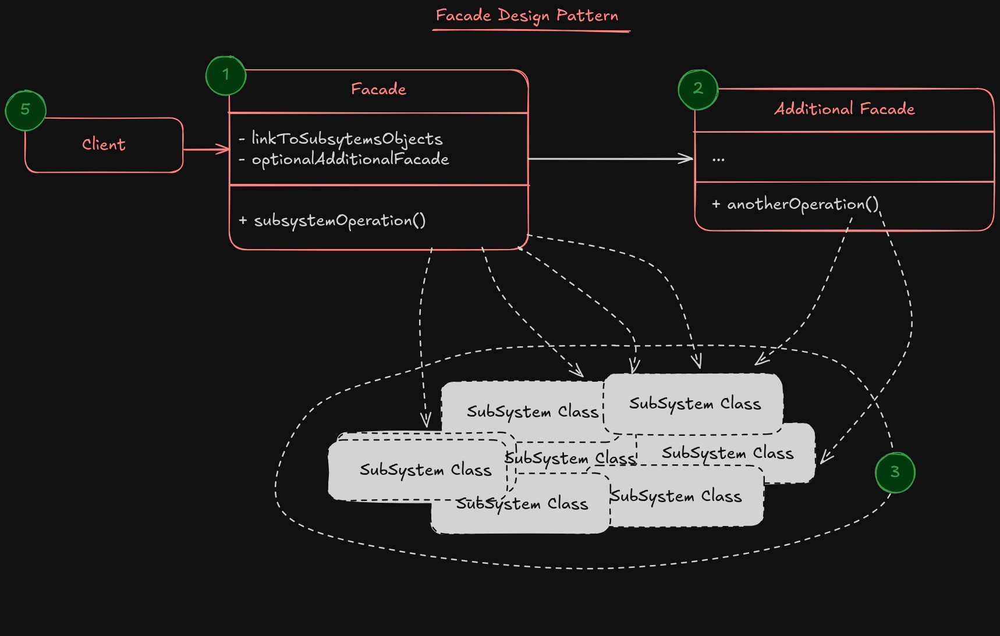

# Facade design pattern

**Facade** is a structural design pattern that provides a simplified interface to a library, a framework, or any other complex set of classes.

**Facade** pattern is more like a concept in my mind, instead of actual pattern. If you have a client code that must do some layered tasks for achieve one purpose, The Facade pattern will be helpful there.

By using Facade, you delegate the layered work to the Facade class, and use a simple interface to call that method, instead of working with different libraries and dependencies.

## Example

Imagine that you have a Upload Video service, like Youtube we can say, and You want to have set of methods that handle users uploaded video. For example you want to first check the video format, then change the video format and set video thumbnail and then save it in your storage. For doing this, there are several method that should called in a row, and the client code become dependent to that flow, and also low level framework and dependencies.

For decoupling client code from low level dependencies, you can delegate this set of method calls from client code to another class called Facade, and then use the single method from this class to achieve your goal.

> [!NOTE]
> A facade is a class that provides a simple interface to a complex subsystem which contains lots of moving parts. A facade might provide limited functionality in comparison to working with the subsystem directly. However, it includes only those features that clients really care about.

### Structure

1. **Facade** provides convenient access to a part of subsystem's functionality.
2. An **Additional Facade** class can be created to prevent polluting a single facade with unrelated features that might make it yet another complex structure.
3. The Complex Subsystem consists of dozens of various objects. To make them all do something meaningful, you have to dive deep into the subsystem’s implementation details, such as initializing objects in the correct order and supplying them with data in the proper format.
4. The Client uses the facade instead of calling the subsystem objects directly.

#### Applicability

- Use the facade pattern when you have a limited but straightforward interface to a complex subsystem.
- Use the Facade when you want to structure a subsystem into layers.

#### How to implement?

1. Check is possible to create a layered flow in client code or not.
2. Declare and implement this interface an a facade class.
3. To get the full benefit from the pattern, make all the client code communicate with the subsystem only via the facade.
Now the client code is protected from any changes in the subsystem code. For example, when a subsystem gets upgraded to a new version, you will only need to modify the code in the facade.
4. If the facade becomes too big, consider extracting part of its behavior to a new, refined facade class.

#### Pros

- You can isolate your code from the complexity of a subsystem.

#### Cons

- A facade can become a god object coupled to all classes of an app.
